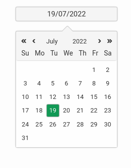
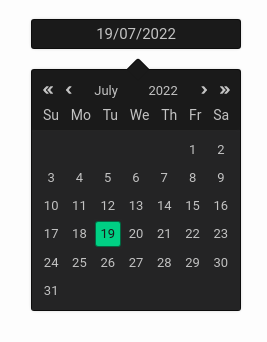
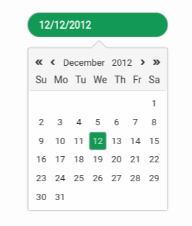

# react-datepickerrz

> With double r & z, a customizable, zero-dependency datepicker component for React

[](https://www.npmjs.com/package/react-datepickerrz) [](https://standardjs.com)


|                Default                |              Dark               |               Custom                |
| :-----------------------------------: | :-----------------------------: | :---------------------------------: |
|  |  |  |


## Install

```bash
npm install --save react-datepickerrz
```

**or**

```bash
yarn add react-datepickerrz
```

## Usage

```jsx
import React, { Component } from 'react'

import DatePicker from 'react-datepickerrz'


export default class Example extends Component {

    onDatePick = date => {
        // the date object stucture => {
        //     day: number, 
        //     month: number, // from 1 to 12
        //     year: number, 
        //     date: Date
        // }

        // do whatever you want with date
    }

    render() {
        return <DatePicker
            inputStyle={`color: red; background-color: blue; border-radius: 50%`}
            activeColor="#119955"
            dark={true}
            date={new Date()}
            lang="es"
            onPickDate={this.onDatePick} />
    }
}

```


## Props

<table width="100%">
<thead>
<th>Props</th>
<th>Types</th>
<th>Required</th>
<th>Default</th>
<th>Description</th>
</thead>
<tbody>
<tr>
<td>inputStyle</td>
<td><code>string</code></td>
<td><code>false</code></td>
<td><code>empty</code></td>
<td><quote>The custom style of the input field</quote></td>
</tr>
<tr>

<td>activeColor</td>
<td><code>string </code></td>
<td><code>false</code></td>
<td><code>#119955</code></td>
<td><quote>The background color of the selected date on the calendar</quote></td>
</tr>

<tr>
<td>date</td>
<td><code>string | Date</code></td>
<td><code>false</code></td>
<td><code>new Date()</code></td>
<td><quote>The default value of the datepicker</quote></td>
</tr>


<tr>
<td>lang</td>
<td><code>string</code></td>
<td><code>false</code></td>
<td><code>en</code></td>
<td><quote>The datepicker langauge, supported languages: [en, fr, it, es, de]</quote></td>
</tr>

<tr>
<td>onPickDate</td>
<td><code>function</code></td>
<td><code>true</code></td>
<td><code>/</code></td>
<td><quote>The date change handler</quote></td>
</tr>
</tbody>

</table>

## Examples

To run the exemple you need to:

-   clone this repo 
-   inside the react-datepickerrz folder run: `yarn` or `npm i` then `yarn build` or `npm build`
-   inside the example folder run: `yarn` or `npm i` then `yarn start` or `npm start`


## Contribution

Feel free to raise an [Issue](https://github.com/AM-77/react-datepickerrz/issues) or submit a [PR](https://github.com/AM-77/react-datepickerrz/pulls).

## Copyright and license

Code copyright 2020 AM-77. Code released under [MIT license](https://github.com/AM-77/react-datepickerrz/blob/master/LICENSE).
